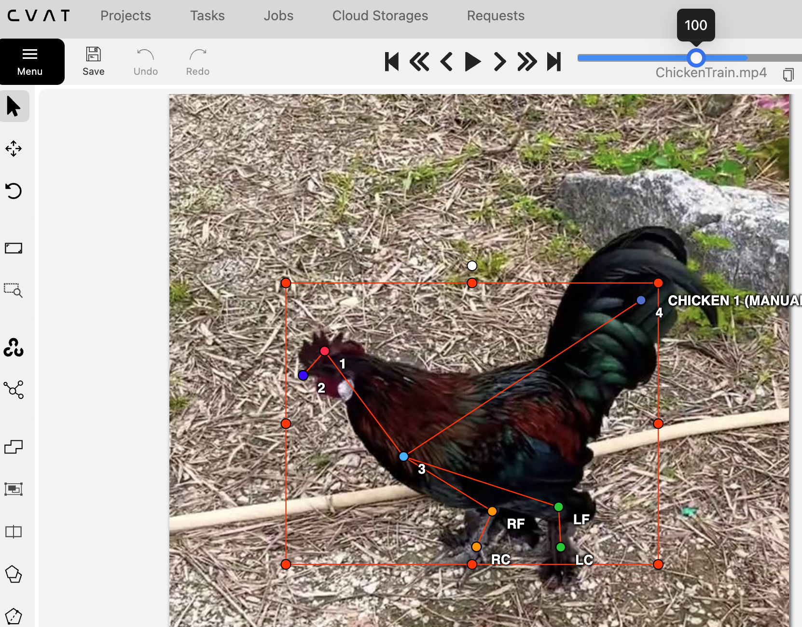
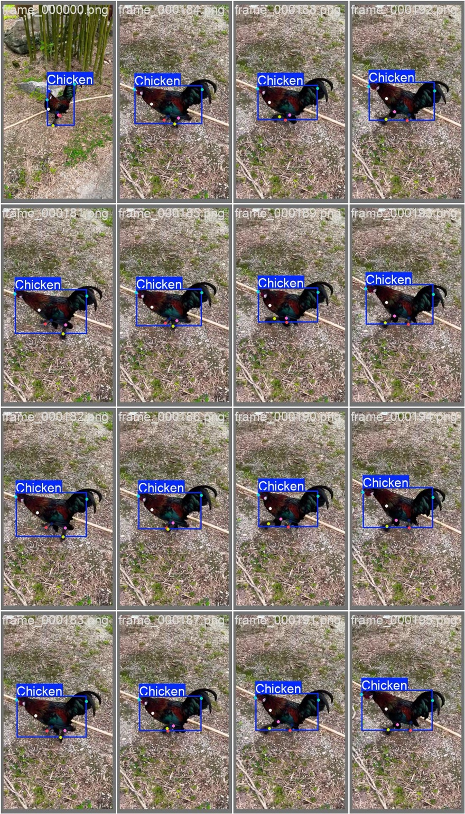
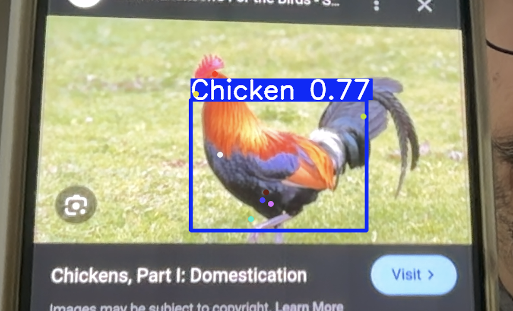
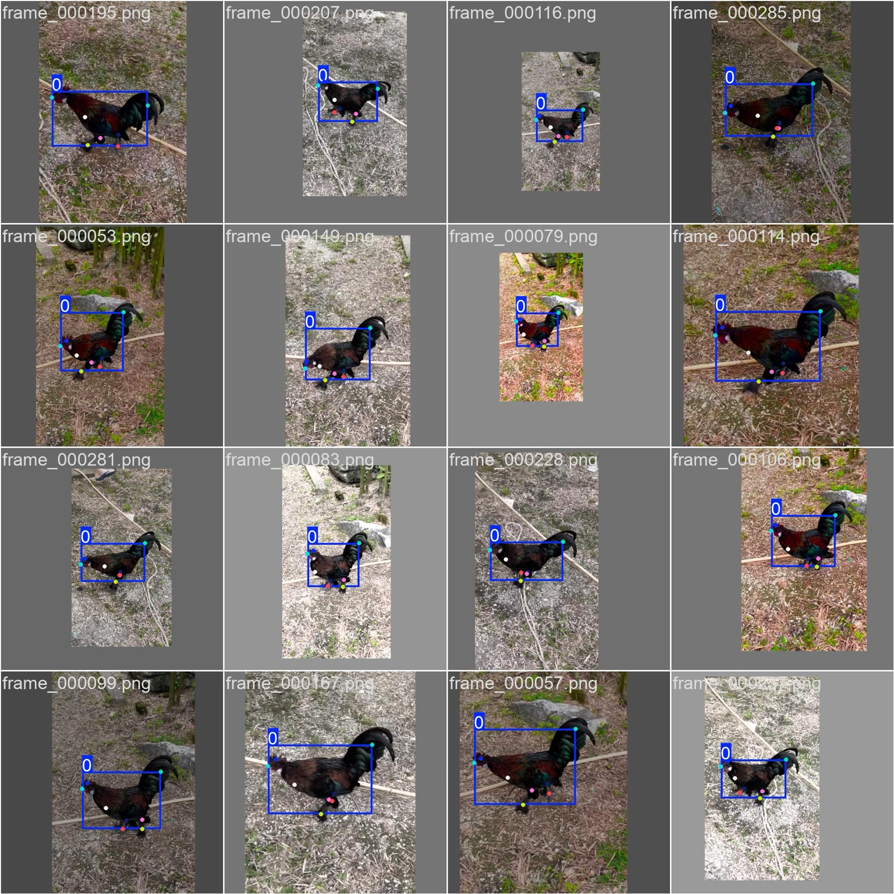

# Chicken Pose Estimation with YOLOv8

This project focuses on real-time pose estimation for chickens using the Ultralytics YOLOv8 Pose model. The workflow involved custom skeleton design, labeling using CVAT, training the YOLOv8n-pose model, and running live predictions.

---

## Table of Contents
- [Project Overview](#project-overview)
- [Dataset Preparation](#dataset-preparation)
- [Model Training](#model-training)
- [Results](#results)
- [Live Predictions](#live-predictions)
- [Visuals](#visuals)

---

## Project Overview

- **Goal**: Detect keypoints (pose) on chickens using a custom skeleton.
- **Labeling Tool**: [CVAT](https://cvat.org/)
- **Model**: YOLOv8n-pose from [Ultralytics](https://github.com/ultralytics/ultralytics)
- **Device**: Apple Silicon (MPS backend)

---

## Dataset Preparation

1. **Custom Skeleton Design**  
   A chicken skeleton was created with 8 keypoints:
   - Head Top, Beak, Body Center, Tail, Right Foot (RF), Left Foot (LF), Right Claw (RC), Left Claw (LC).

   

2. **Labeling in CVAT**  
   286 frames from a chicken video were labeled.

   

3. **Dataset Export**  
   Exported using **Ultralytics YOLO Pose 1.0** format.

4. **config.yaml**:
   ```yaml
   path: /Users/barbarosyesilova/Documents/Chicken_Prj/data
   train: images/Train
   val:   images/Val

   nc:    1
   names:
     0: Chicken

   kpt_shape: [8, 3]
   ```

---

## Model Training

- **Command**:
  ```bash
  yolo pose train model=yolov8n-pose.pt data=config.yaml epochs=70 imgsz=640 device=mps name=train_chicken
  ```

- **Training Configuration**:
  - Epochs: 70
  - Image Size: 640x640
  - Device: MPS (Apple Silicon)

- **Training Loss & Metrics**:

  

- **Sample Training Batches**:
  - Batch 0  
    
  - Batch 1  
    
  - Batch 2  
    

---

## Results

- High precision and recall achieved.
- mAP50-95 performance shows consistent improvement.

- **Validation Batch Example**:  
  

---

## Live Predictions

- **Command**:
  ```bash
  yolo task=detect mode=predict model=/opt/homebrew/runs/pose/train_chicken3/weights/best.pt source=0 show=true device=mps
  ```

- Real-time chicken pose prediction using laptop camera:

  

---

## Visuals

- **More Training Batch Samples**:
  - Batch 1080  
    
  - Batch 1081  
    
  - Batch 1082  
    

